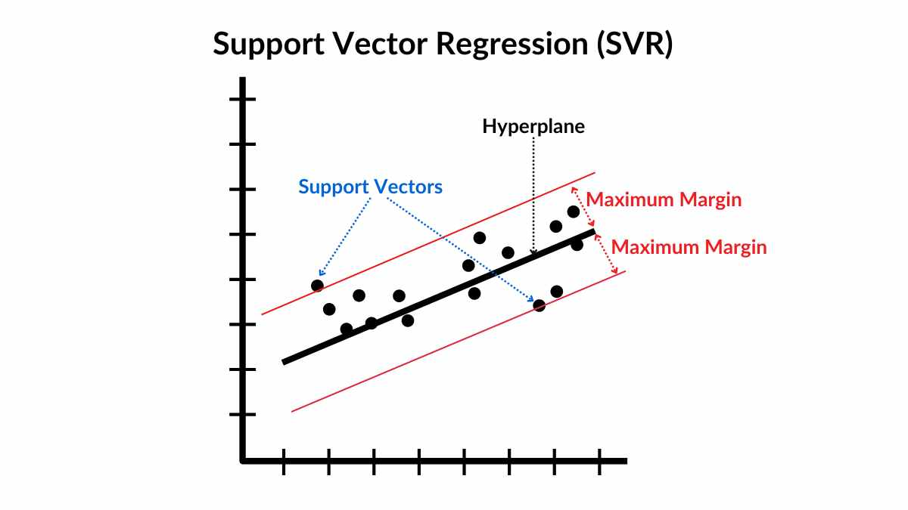

# Regression

Welcome to the land of regression 
Regression is all about predicting continuous outcomes. Instead of answering “yes or no” (classification), regression answers questions like *How much?*, *How many?*, or *What value next?*.

Think of it this way: you’ve got some features — hours studied, temperature outside, square footage of a house — and you want to predict a real-valued target — exam score, ice cream sales, or house price. Regression builds a mathematical relationship between the inputs \(X\) and the output \(y\), then uses that relationship to predict new outcomes.

At its core, regression is simple: draw a line through data points and measure how close you are. But from that simple idea grew an entire family of models — straight lines, curves, margin-based fits, branching trees, and even forests of them. Each comes with trade-offs: interpretability, flexibility, speed, or robustness.

In this repo, you’ll walk through the major regression models — from the classics like **Linear Regression** to more advanced approaches like **Support Vector Regression** and **Random Forests**. Each section explains the intuition, shows the formula shape (without drowning you in math), and includes runnable Python code you can try right away.

    

## What regression is (and why you use it)

Regression predicts a continuous target such as price, temperature, or demand. You learn a function ŷ = f(x) and compare it to the truth y. The miss is the residual, ε = y - ŷ. If residuals are random around zero and don't show a pattern, you're modeling the signal; if they curve, trend, or fan out, your current model is missing structure.

## Simple linear regression (the straight-line baseline)
Linear Regression is the most basic form of regression. It tries to draw a straight line that best describes the relationship between an input variable
x and an output variable y.

    

<strong>Shape only:</strong> y = b + ax

- Intercept b is the baseline when x = 0
- Slope a is "change in y per one unit of x"

---

## Assumptions of Linear Regression

    

Linear regression relies on several key assumptions. When these are satisfied, the model gives more reliable estimates and predictions.

| **1. Linearity** | **2. Homoscedasticity** |
|------------------|--------------------------|
| There should be a linear relationship between the independent variables \(X\) and the dependent variable \(Y\). | The residuals should have constant variance across all levels of the independent variables (equal spread). |

| **3. Multivariate Normality** | **4. Independence** |
|-------------------------------|---------------------|
| The residuals are assumed to be normally distributed. This matters for inference like confidence intervals and hypothesis tests. | Observations must be independent. In time-series data, this means no autocorrelation between residuals. |

| **5. Lack of Multicollinearity** | **6. Outlier Check** |
|---------------------------------|-----------------------|
| Predictors should not be highly correlated with each other. High correlation makes coefficient estimates unstable. | Not a strict assumption, but important in practice. Outliers can strongly influence the regression line and skew results. |

---

## Multiple linear regression (many features, same idea)

Simple linear regression uses one feature to predict one outcome. Multiple Linear Regression (MLR) is the extension: you use **many features at once** to predict a continuous target.  

The equation looks like this:

y = b + a₁x₁ + a₂x₂ + ⋯ + aₙxₙ

- \(b\) is the intercept (baseline value when all features are 0).  
- \(a_i\) is the coefficient for feature \(x_i\) (how much \(y\) changes if \(x_i\) increases by one unit, while the others stay fixed).  

---

## Model Building Strategies

Choosing which features to keep in a regression model:

**Backward Elimination (most common)**  
Start with all features and remove the least useful one step by step until only strong features remain.

**Forward Selection**  
Start empty and add the most useful features step by step.

**Bidirectional (Stepwise)**  
Mix of forward and backward — add strong ones, drop weak ones.

**All-in**  
Keep all features without selection (simple but not always efficient).

---

## Polynomial regression (linear model, non-linear shape)

Linear Regression can only draw a straight line. But real data often curves.  
Polynomial Regression fixes that by adding higher powers of the feature to the model.  

**Shape only (one feature):**

y = b + a₁x + a₂x² + ⋯ + aₐxᵈ

    

So instead of just fitting a line, the model can fit a curve.  
- A **low degree** (like 2 or 3) captures gentle bends in the data.  
- A **high degree** can follow the data closely, but might also “chase the noise” → **overfitting**.  

One detail: higher powers like (x^3) or (x^4) can create very large numbers, so scaling your features often makes training more stable.

**In short:** Polynomial Regression = Linear Regression trained on curved features. It’s your go-to when the straight line isn’t enough.

---

## Support Vector Regression (SVR) in one paragraph

    

SVR takes the idea of regression and adds a margin of tolerance. Imagine drawing a line (or curve) that keeps most points inside a tube of width ε. Points inside the tube are considered “close enough,” so no penalty. Points outside the tube are the ones the model cares about, and the cost of missing them is controlled by the parameter **C**.

What makes SVR powerful is the use of **kernels**, which define the shape of the fit:
- **Linear kernel**: straight-line relationships.  
- **Polynomial kernel**: global curves and feature interactions.  
- **RBF kernel**: smooth, flexible curves where each training point acts like a little bell of influence — nearby points matter more than distant ones.  

A key detail: **scaling is mandatory**. Both the inputs \(X\) and the target \(y\) must be scaled before training. After predicting, you inverse-transform the results to bring them back to the original units so they make sense in real-world terms.

---
## Decision Trees and Random forests (thresholds, interactions, and stability)

    
    &nbsp;&nbsp;&nbsp;
    

| **Decision Trees** | **Random Forests** |
|--------------------|---------------------|
| Split features into regions and predict the average value in each region. | Train many decision trees on random subsets of data and features, then average their predictions. |
| No scaling needed (they split on thresholds, not distances). | No scaling needed (inherits from trees). |
| Very expressive but can easily **overfit** if grown deep. | Averaging reduces variance → more stable and accurate than a single tree. |
| Always set `random_state` for reproducibility (splits with ties can change). | Key parameters: `n_estimators` (number of trees), `random_state` (reproducibility). |

---

## Evaluation metrics you actually use

**RSS** (Residual Sum of Squares) sums squared residuals; **TSS** (Total Sum of Squares) measures total variation around the mean;

**R² = 1 - RSS/TSS** is the fraction of variance explained; **Adjusted R²** corrects the tendency of R² to inflate as you add features by penalizing complexity relative to sample size. In scikit-learn you'll commonly call `sklearn.metrics.r2_score(y_test, y_pred)`.

---

## Overfitting vs underfitting (and what to do)

**Underfitting**  
This happens when the model is too simple to capture the real patterns in the data. It struggles to explain the training data and naturally performs poorly on the test data as well.  

**Overfitting**  
This happens when the model memorizes noise and quirks in the training data instead of learning the underlying trend. It shows excellent performance on the training set but fails to generalize, leading to weak results on the test set.  

In practice, finding the right balance is about choosing a model that is flexible enough to capture the signal but not so flexible that it chases random fluctuations. There are several ways to address this trade-off: improve your features to give the model better information, simplify the model by lowering polynomial degree or limiting tree depth, or apply regularization methods such as Ridge and Lasso for linear models. Cross-validation is the go-to method to check which configuration actually generalizes. And if the residuals reveal that a straight line cannot explain the data (for example, if they curve systematically), it’s usually better to switch to a different family of models rather than forcing the current one to fit.

---
## Choosing Between Linear, Polynomial, SVR, Trees, and Forests

    

Start with the simplest model that could work. If the relationship looks straight and interpretability is important, go with Linear or Multiple Linear Regression. When residuals show a curved pattern, a Polynomial Regression is often the next step.  

If you need a smooth and flexible fit and are comfortable tuning hyperparameters, SVR with an RBF kernel is a strong choice. When you expect thresholds, interaction effects, or want minimal preprocessing, a Decision Tree is a good probe. For more accuracy and stability Random Forests usually outperform a single tree by averaging many of them.  

If the model’s performance is disappointing, try tuning first. But if residual plots clearly suggest the model family is the wrong shape, don’t force it — switch to another model that matches the data’s structure better.

## Categorical vs Numeric Features

Not all features are the same.  

**Numeric features** (like age, salary, temperature) can be used directly in regression after cleaning.  

**Categorical features** (like city, gender, product type) need to be turned into numbers. The standard method is **one-hot encoding**:  
- Create a new binary column (0/1) for each category.  
- Drop one column per categorical feature to avoid the **dummy variable trap**, where columns become perfectly correlated.  
- The dropped category becomes the **baseline** for comparison.  

---
## Quick Answers (FAQ Style)

### Why reshape in SVR but not in Decision Tree examples?
scikit-learn expects features as a 2-D array `(n_samples, n_features)`. In SVR you started from a 1-D vector, so you reshaped to `(-1, 1)`. In tree examples you already had 2-D arrays, so no reshape was needed.

### Model bad — tune or switch?
Tune hyperparameters and improve features first. If residual plots clearly show the model shape is wrong (like a straight line for curved data), switch families instead of forcing the wrong one.

### What is ensemble learning here?
It means combining multiple models. A Random Forest trains many decision trees on random subsets of data and features, then averages their predictions. Key parameters: `n_estimators`, `random_state`.

<strong>Congrats… you just survived the rollercoaster called Regression</strong>

chao
