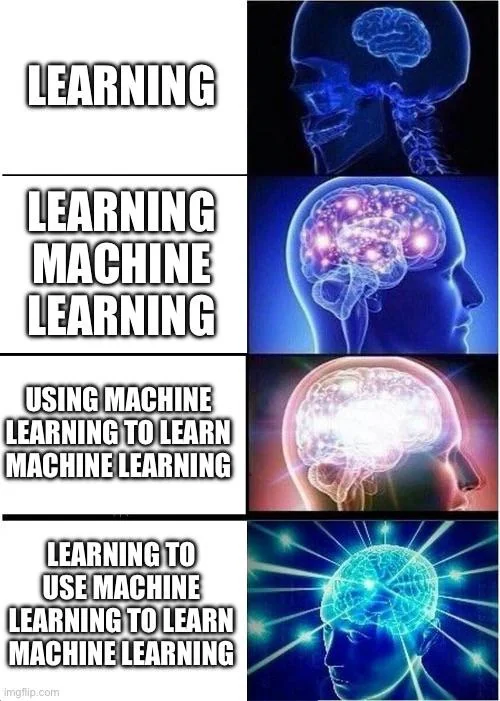

    

# *Machine Learning*

**About this Repo**

This repo is my personal **learning journal** for Machine Learning — a mix of notes, explanations, and code experiments.  
It’s not a textbook. It’s where I break down complex ideas, write in my own words, and test them in code.  

The purpose is simple:  
- build a solid understanding of ML concepts.  
- keep everything organized and beginner-friendly.  
- share runnable examples so you can learn by doing.  

---

## What Is Machine Learning?  

Machine Learning (ML) is a field of Artificial Intelligence that enables computers to **learn patterns from data** instead of being explicitly programmed.  
The model observes examples, finds relationships, and uses them to make predictions or decisions when it encounters new data.  

    

Mathematically, ML tries to approximate a function `f(x)` that maps inputs `x` to outputs `y`.  
Over time, the model learns parameters that make its predictions as close as possible to real outcomes.  

---

## Real-World Applications  

ML quietly powers much of the world around us. Examples include:  
- **Healthcare** disease detection, personalized treatment.  
- **Finance** fraud detection, stock price prediction.  
- **Agriculture** crop monitoring, yield estimation.  
- **Education** adaptive learning systems.  
- **Transportation** self-driving cars, route optimization.  
- **Entertainment** recommendation systems (Netflix, Spotify).  

Each domain uses a different kind of data, but the core idea remains the same — *learn from experience*.  

---

## Types of Learning  

ML algorithms are categorized by how they learn from data:  

### 1. Supervised Learning  
The model learns from labeled data — examples where both input and correct output are known.  
It tries to minimize the difference between predicted and actual outputs.  
Used for **Regression** (predicting continuous values) and **Classification** (predicting categories).  

### 2. Unsupervised Learning  
No labels here. The model explores the data’s hidden structure — grouping or organizing similar items.  
Used for **Clustering**, **Dimensionality Reduction**, and **Association Rule Learning**.  

### 3. Reinforcement Learning  
Instead of examples, the model learns by **trial and error**.  
It interacts with an environment, receives **rewards** or **penalties**, and improves over time.  
Used in **robotics**, **game AI**, and **autonomous systems**.  

---

## Data Types in Machine Learning  

ML models handle many forms of data:  

| Type | Description | Example |
|------|--------------|----------|
| **Numerical** | Quantitative values, continuous or discrete | Age, temperature, salary |
| **Categorical** | Qualitative labels or classes | Gender, color, country |
| **Textual** | Words, sentences, documents | Chat logs, news articles |
| **Image / Video** | Pixel data | Medical scans, surveillance footage |
| **Audio** | Waveform data | Speech, music |
| **Time-Series** | Sequential data | Stock prices, sensor readings |

---

## Map of Topics  

The repo is organized into separate markdown files — each covering one ML concept clearly with explanations and code.  

- [Part 1 – Data Preprocessing](https://github.com/AI-UNIT-IT-KKU/ML-until-sunrise-explaination/blob/main/part-1-data-preprocessing/00_starting.md)  
- [Part 2 – Regression](https://github.com/AI-UNIT-IT-KKU/ML-until-sunrise-explaination/blob/main/part-2-regression/regression_guide.md)  
- [Part 3 – Classification](https://github.com/AI-UNIT-IT-KKU/ML-until-sunrise-explaination/blob/main/part-3-classification/classification_guide.md)  
- [Part 4 – Clustering](https://github.com/AI-UNIT-IT-KKU/ML-until-sunrise-explaination/blob/main/part-4-clustring/clustring_guide.md)  
- [Part 5 – Association Rule Learning](https://github.com/AI-UNIT-IT-KKU/ML-until-sunrise-explaination/blob/main/part-5-Association-Rule/Association_Rule_guide.md)  
- [Part 6 – Reinforcement Learning](https://github.com/AI-UNIT-IT-KKU/ML-until-sunrise-explaination/blob/main/part-6-Reinforcement_Learning/reinforcement_learning_guide.md)  
- [Part 7 – Natural Language Processing](https://github.com/AI-UNIT-IT-KKU/ML-until-sunrise-explaination/blob/main/part-7-NLP/NLP_guide.md)  
- [Part 8 – Convolutional Neural Networks](https://github.com/AI-UNIT-IT-KKU/ML-until-sunrise-explaination/blob/main/part-8-CNN/CNN_guide.md)  

**Part 9 – Coming Soon**

---

## 🚧 Status  

This repo is a **work in progress** — updated whenever I learn something new or find a clearer way to explain it.  
Each file is meant to grow and improve over time.  

Chao
