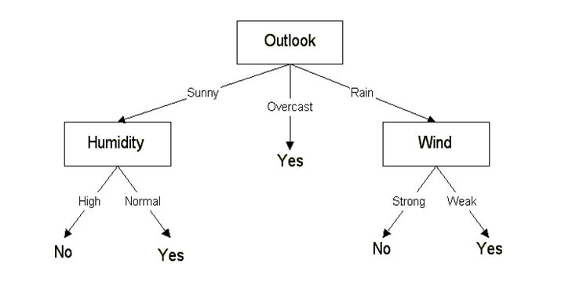

# Classification

## What you’re learning

Classification predicts a **category** for each example. Spam or not. Fraud or not. Tumor type A or B. We model a function that turns features into a probability or a class label. Most of the work is not the model; it’s making sure data, evaluation, and decisions are set up correctly.

<p align="center">
    
</p>
## Your mental model in one paragraph

Think of the model as a boundary drawer. It looks at the feature space and tries to separate classes with the cleanest boundary it can manage. Sometimes the world is nearly linear and a straight boundary works. Often it isn’t, and we bend the space (kernels, trees, ensembles) to get a better split. We measure how good that boundary is with metrics that reflect what we actually care about, not just raw accuracy.

## Data prep that actually matters

Get a simple, reproducible pipeline. Split your data into train and test (and usually a validation set via cross‑validation). Scale only the **features** that need scaling; the target is categorical and shouldn’t be scaled. Encode categories (OneHot), handle missing values, and keep the same transforms for train and test using a pipeline.

```python
from sklearn.model_selection import train_test_split
from sklearn.preprocessing import StandardScaler, OneHotEncoder
from sklearn.compose import ColumnTransformer
from sklearn.pipeline import Pipeline
from sklearn.linear_model import LogisticRegression

num_cols = ["age","income"]
cat_cols = ["city","channel"]

pre = ColumnTransformer([
    ("num", StandardScaler(), num_cols),
    ("cat", OneHotEncoder(handle_unknown="ignore"), cat_cols)
])

clf = Pipeline([
    ("prep", pre),
    ("model", LogisticRegression(max_iter=200))
])

X_train, X_test, y_train, y_test = train_test_split(X, y, test_size=0.2, stratify=y, random_state=42)
clf.fit(X_train, y_train)
```

## Metrics without the confusion

Accuracy is the percent correct. It’s fine when classes are balanced and errors cost the same. When they aren’t, reach for **precision** (how many of the predicted positives were correct), **recall** (how many actual positives we caught), and **F1** (their harmonic mean). For ranking by confidence, ROC‑AUC summarize the curve as you move the threshold. The confusion matrix shows where the model is confused.

```python
from sklearn.metrics import accuracy_score, precision_score, recall_score, f1_score, ConfusionMatrixDisplay

y_pred = clf.predict(X_test)
print("acc", accuracy_score(y_test, y_pred))
print("prec", precision_score(y_test, y_pred, zero_division=0))
print("rec", recall_score(y_test, y_pred))
print("f1", f1_score(y_test, y_pred))
ConfusionMatrixDisplay.from_estimator(clf, X_test, y_test)
```

## Thresholds and calibration

Most classifiers can output `predict_proba`. Turning probabilities into labels requires a **threshold** (default is 0.5). Move it to trade precision for recall depending on your goal. If probabilities feel over‑confident or under‑confident, use calibration so that a predicted 0.7 really behaves like a 70% chance over many cases.

## Accuracy paradox (and how to dodge it)

When one class dominates, a silly model can score high accuracy by predicting the majority class every time. That’s the paradox: great accuracy, useless model. Fix it by using stratified splits, measuring precision/recall or PR‑AUC, and balancing the training signal with class weights or with resampling.

## CAP curve and AR, in plain words

The **Cumulative Accuracy Profile (CAP)** answers a practical question: if you can only act on the top x% of cases ranked by model score, what fraction of the true positives would you capture? Plot cumulative captured positives vs the fraction of the population you contact. The **AR (Accuracy Ratio)** compares your model’s area under the CAP to a random model and to a perfect model

A higher AR means your ranking is more useful in targeted actions like marketing or risk review.

## Quick tour of the core models

### Logistic Regression

Despite the name, it’s a classifier. It models the log‑odds of the positive class as a linear function of features, and uses maximum likelihood to fit coefficients. It’s fast, well‑calibrated, and easy to interpret. Works best when the decision boundary is roughly linear after appropriate transforms.

<p align="center">
    
</p>

```python
from sklearn.linear_model import LogisticRegression
model = LogisticRegression(max_iter=300, C=1.0, penalty="l2", solver="lbfgs")
```

### K‑Nearest Neighbors (KNN)

No training phase beyond storing the data. To classify a new point, look at the k closest training points and vote. Sensitive to scaling and to `k`. Simple, can be strong on structured data with a good distance metric.

<p align="center">
    
</p>

```python
from sklearn.neighbors import KNeighborsClassifier
model = KNeighborsClassifier(n_neighbors=7, metric="minkowski", p=2)
```

### Support Vector Machines (SVM)

A margin maximizer. It finds the hyperplane that separates classes with the largest margin. When data aren’t linearly separable, the kernel trick implicitly lifts data into a higher‑dimensional space. Popular kernels: linear, polynomial, and RBF.

<p align="center">
    
</p>

```python
from sklearn.svm import SVC
linear = SVC(kernel="linear", C=1.0, probability=True)
rbf = SVC(kernel="rbf", C=1.0, gamma="scale", probability=True)
```

### Naive Bayes

Fast, probabilistic, and surprisingly effective with text or high‑dimensional sparse features. It applies Bayes’ rule with a strong independence assumption between features. Variants include GaussianNB for continuous features and MultinomialNB for counts.

<p align="center">
    
</p>

```python
from sklearn.naive_bayes import GaussianNB, MultinomialNB
```

### Decision Tree

Grows an if‑else tree by splitting features to reduce impurity. Interpretable, handles nonlinearity and interactions automatically, no scaling needed, but can overfit—prune or limit depth.

<p align="center">
    
</p>

```python
from sklearn.tree import DecisionTreeClassifier
model = DecisionTreeClassifier(criterion="entropy", max_depth=None, random_state=42)
```

### Random Forest

An ensemble of many decision trees trained on bootstrapped samples and random feature subsets. Lower variance than a single tree, strong out‑of‑the‑box performance, feature importance built in.

<p align="center">
    
</p>

```python
from sklearn.ensemble import RandomForestClassifier
model = RandomForestClassifier(n_estimators=300, criterion="entropy", random_state=42, n_jobs=-1)
```

## Model selection

Detect whether your problem is close to linear or clearly nonlinear. Try a simple linear model as a baseline. If performance stalls, switch to kernels or tree‑based methods. Validate choices with k‑fold cross‑validation and compare on the metric you care about.

```python
from sklearn.model_selection import StratifiedKFold, cross_val_score
cv = StratifiedKFold(n_splits=5, shuffle=True, random_state=42)
scores = cross_val_score(clf, X, y, scoring="f1", cv=cv)
print(scores.mean(), scores.std())
```

## Tuning the right way

Tuning means adjusting hyperparameters to improve validation performance. Logistic Regression has `C`. SVM has `C` and `gamma`. Random Forest has `n_estimators`, `max_depth`, and friends. Use `GridSearchCV` or `RandomizedSearchCV` so the whole process is cross‑validated together.

```python
from sklearn.model_selection import GridSearchCV
param_grid = {"model__C": [0.1, 1, 10]}
search = GridSearchCV(clf, param_grid, scoring="f1", cv=5, n_jobs=-1)
search.fit(X_train, y_train)
print(search.best_params_, search.best_score_)
```

## When to choose what

Start with Logistic Regression if you want calibrated probabilities and a quick baseline. Move to linear SVM if you need margins and robustness. Pick RBF‑SVM when you suspect nonlinear boundaries and you can afford tuning. Grab Naive Bayes for text or count features. Choose a Decision Tree when interpretability is the priority. Use Random Forest when you just want strong performance with minimal tuning.

---

**Quick Answers**

* Logistic vs Linear Regression? Logistic outputs probabilities for classes via the logistic link; Linear Regression predicts a continuous value. Different loss and objective. Maximum likelihood is how Logistic finds its coefficients.
* Feature scaling? Yes, scale independent features when needed; the categorical target is never scaled.
* KNN metric? Minkowski with `p=2` is Euclidean; `p=1` is Manhattan.
* SVM maximum margin? It’s the widest strip between classes that contains no points; maximizing it improves generalization.
* Kernel trick? It computes similarities as if data were mapped to a higher space, without building that space explicitly.
* CAP and AR? Use them when you care about ranking quality for limited‑budget actions; AR summarizes how much better than random your ranking is.
* Accuracy paradox? High accuracy can hide total failure on the minority class—use class‑aware metrics.

