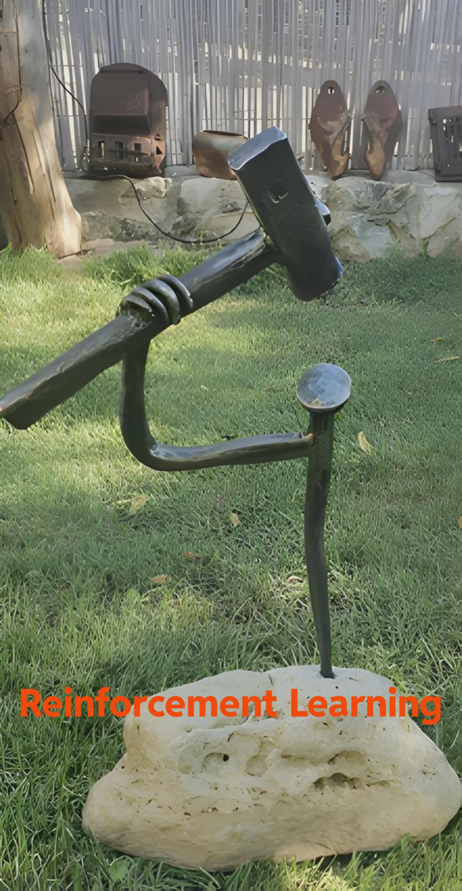
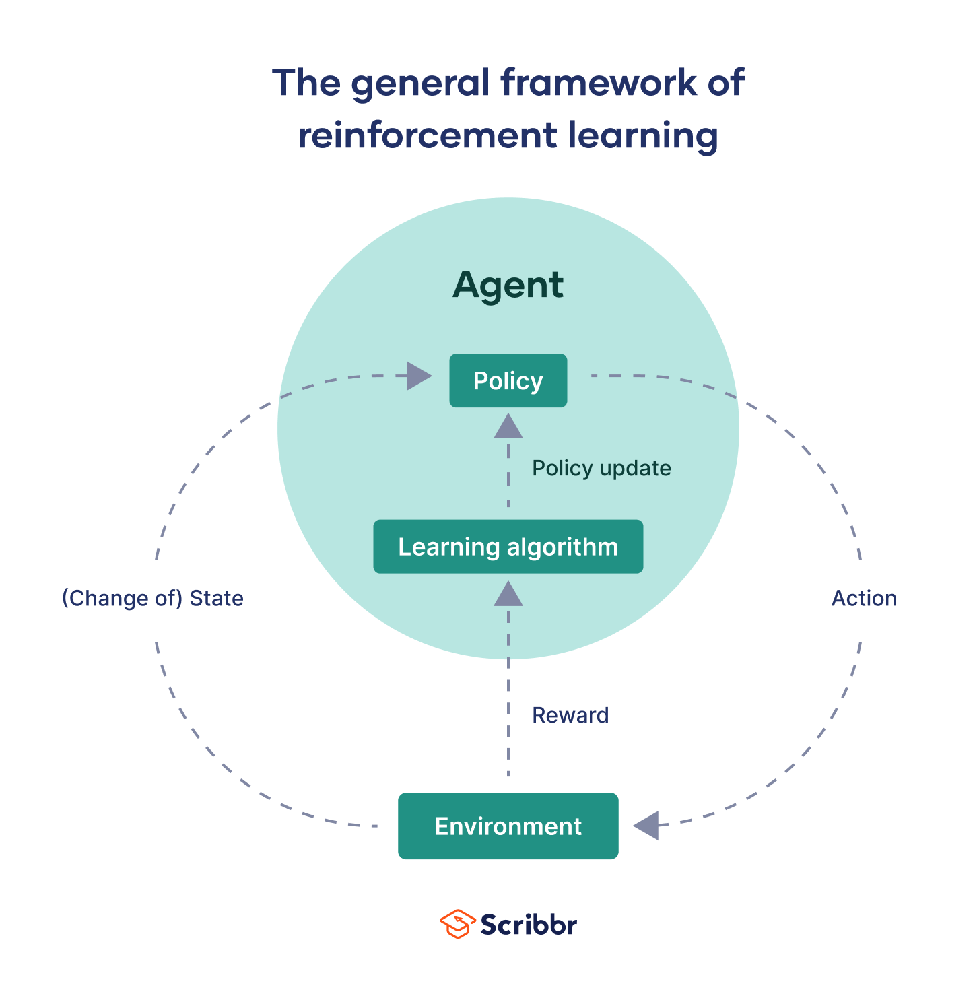
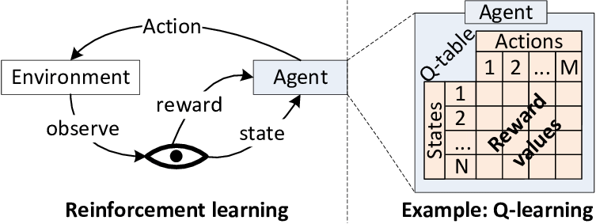

# Reinforcement Learning

<table>
<tr>
<td style="width:60%; vertical-align:top; text-align:left;">
  
Reinforcement Learning is a computational approach to learning through interaction.  
An agent learns to make optimal decisions by taking actions in an environment, observing the consequences, and adjusting its behavior to maximize cumulative rewards over time.  

Unlike supervised learning, where correct answers are provided explicitly, RL agents must discover effective strategies through trial and error.  
This learning paradigm mirrors how humans and animals learn from experience, making it particularly suited for sequential decision-making problems.

</td>
<td style="width:40%; text-align:right;">



</td>
</tr>
</table>


---

## Fundamental Components

<p align="center">
    
</p>

**Agent**  The decision-maker that learns and takes actions within the environment.

**Environment**
The external system with which the agent interacts. It responds to the agent's actions by transitioning to new states and providing rewards.

**State**
A representation of the current situation or configuration of the environment. States contain all relevant information needed for decision-making.

**Action**
A choice made by the agent that affects the environment. Actions can be discrete (like chess moves) or continuous (like steering angles).

**Reward**
A scalar feedback signal indicating the immediate desirability of a state or action. The agent's objective is to maximize the cumulative reward over time.

**Policy**
The agent's strategy for selecting actions. Formally, a policy maps states to actions, defining the agent's behavior.

**Value Function**
An estimate of the expected cumulative reward achievable from a given state (or state-action pair) when following a particular policy. Value functions guide the agent toward more rewarding trajectories.

---

## Policy Types

### Deterministic Policies
A deterministic policy always selects the same action for a given state. The mapping from states to actions is fixed and predictable.

**Notation:** π(s) = a

### Stochastic Policies
A stochastic policy outputs a probability distribution over actions for each state. The agent samples from this distribution, introducing controlled randomness that aids exploration.

**Notation:** π(a|s) = P(Action = a | State = s)

Stochastic policies are particularly valuable during learning, as they naturally encourage the agent to explore different actions rather than prematurely converging to suboptimal strategies.

---

## Learning Paradigms

### Model-Free Learning
Model-free methods learn directly from experience without constructing an internal model of the environment's dynamics. The agent simply tries actions and learns which ones yield better outcomes.

**Advantages:**
- Simpler to implement
- No need to model complex environment dynamics
- Works well when the environment is unknown or difficult to model

**Disadvantages:**
- Requires more experience to learn
- Cannot plan ahead without actually taking actions

**Examples:** Q-Learning, SARSA, Policy Gradient methods

### Model-Based Learning
Model-based methods learn a predictive model of the environment that forecasts how states transition and what rewards result from actions. With this model, the agent can simulate potential futures and plan optimal action sequences.

**Advantages:**
- More sample-efficient
- Enables planning and mental simulation
- Can reason about long-term consequences

**Disadvantages:**
- Model errors compound over time
- Requires significant computational resources
- Difficult to model complex environments accurately

**Examples:** Dyna-Q, Model Predictive Control, AlphaZero

---

## Learning Strategies

### On-Policy Learning
On-policy algorithms learn about the policy they are currently executing. The agent evaluates and improves the same policy it uses to generate experience.

**Characteristics:**
- Learns from its own actions
- More stable but potentially slower
- Better suited when the current policy is close to optimal

**Primary Example:** SARSA (State-Action-Reward-State-Action)

SARSA updates its value estimates based on the action actually taken by the current policy, ensuring that learning is aligned with behavior.

### Off-Policy Learning
Off-policy algorithms can learn about an optimal policy while following a different exploratory policy. This separation allows the agent to learn from diverse experiences, including those generated by other agents or from historical data.

**Characteristics:**
- Learns the optimal policy regardless of the policy being executed
- Greater flexibility and sample efficiency
- Can learn from demonstrations or replayed experience

**Primary Example:** Q-Learning

Q-learning always updates toward the maximum possible value, assuming optimal future actions, regardless of what the agent actually does next.

---

## Core Algorithms

### Q-Learning
A foundational off-policy algorithm that learns the optimal action-value function. Q-learning maintains a table (or function approximator) of Q-values representing the expected return for taking each action in each state.

<p >
    
</p>

**Update Rule:**
```
Q(s,a) ← Q(s,a) + α[r + γ max Q(s',a') - Q(s,a)]
```

### SARSA
An on-policy temporal difference method that learns while following its current policy. Unlike Q-learning, SARSA considers the action actually taken in the next state.

**Update Rule:**
```
Q(s,a) ← Q(s,a) + α[r + γ Q(s',a') - Q(s,a)]
```

### Deep Q-Network (DQN)
Extends Q-learning to high-dimensional state spaces by using deep neural networks as function approximators. DQN introduced experience replay and target networks to stabilize learning.

**Key Innovations:**
- Experience replay buffer for breaking temporal correlations
- Separate target network for stable value estimation
- Applicable to complex environments like Atari games

### Policy Gradient Methods
Rather than learning value functions, policy gradient methods directly optimize the policy by following the gradient of expected return. REINFORCE is the canonical algorithm in this family.

**Advantages:**
- Natural for continuous action spaces
- Can learn stochastic policies
- Effective for problems where finding optimal values is harder than finding optimal policies

### Actor-Critic Methods
Hybrid approaches that combine value-based and policy-based learning. The "actor" maintains the policy, while the "critic" estimates value functions to guide the actor's updates.

**Benefits:**
- Lower variance than pure policy gradient methods
- More sample-efficient than pure policy methods
- Flexible and widely applicable

**Examples:** A3C (Asynchronous Advantage Actor-Critic), PPO (Proximal Policy Optimization)

### Advanced Algorithms for Continuous Control

**DDPG (Deep Deterministic Policy Gradient)**
An actor-critic algorithm designed for continuous action spaces, combining DQN's techniques with policy gradient methods.

**SAC (Soft Actor-Critic)**
An off-policy algorithm that maximizes both expected return and entropy, encouraging exploration and producing robust, stochastic policies.

---

## The Exploration-Exploitation Trade-off

A central challenge in RL is balancing exploration (trying new actions to discover better strategies) with exploitation (using known information to maximize rewards). Too much exploration wastes time on suboptimal actions; too much exploitation risks missing better alternatives.


### Epsilon-Greedy Strategy
The agent exploits the best-known action with probability (1-ε) and explores a random action with probability ε.

**Implementation:**
- Simple and widely used
- ε typically decays over time as the agent gains knowledge
- Easy to tune and understand

### Upper Confidence Bound (UCB)
Selects actions based on both their estimated value and the uncertainty in that estimate. Actions that have been tried less frequently receive an exploration bonus.

**Formula:**
```
UCB(a) = Q(a) + c√(ln(t)/N(a))
```

Where N(a) is the number of times action a has been selected and c controls the exploration degree.

### Thompson Sampling
A Bayesian approach that maintains probability distributions over action values and samples from these distributions to make decisions.

**Characteristics:**
- Naturally balances exploration and exploitation
- Theoretically optimal in many settings
- More sophisticated but computationally intensive

## When Things Go Wrong>> Reward Hacking

Even though RL is powerful, sometimes agents don’t learn the behavior we expect.  
Instead, they exploit loopholes in the reward system to maximize points in unintended ways.  
This phenomenon is called **Reward Hacking** or **Specification Gaming**.

**Reward Hacking be like:**
<p >
    
</p>

---

## Conclusion

Reinforcement Learning provides a powerful framework for training agents to make sequential decisions in complex environments. By combining elements of trial-and-error learning, value estimation, and strategic exploration, RL algorithms can discover sophisticated behaviors without explicit instruction.

From the foundational concepts of states, actions, and rewards to advanced algorithms like SAC and PPO, the field offers a rich toolkit for tackling problems ranging from robotics and game playing to resource management and autonomous systems.

The key to effective RL lies in understanding the trade-offs: on-policy versus off-policy, model-free versus model-based, exploration versus exploitation. Mastering these concepts enables practitioners to select and adapt algorithms to their specific problem domains, unlocking the potential of learning through interaction.
