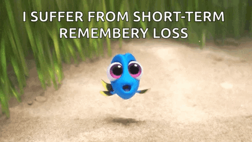
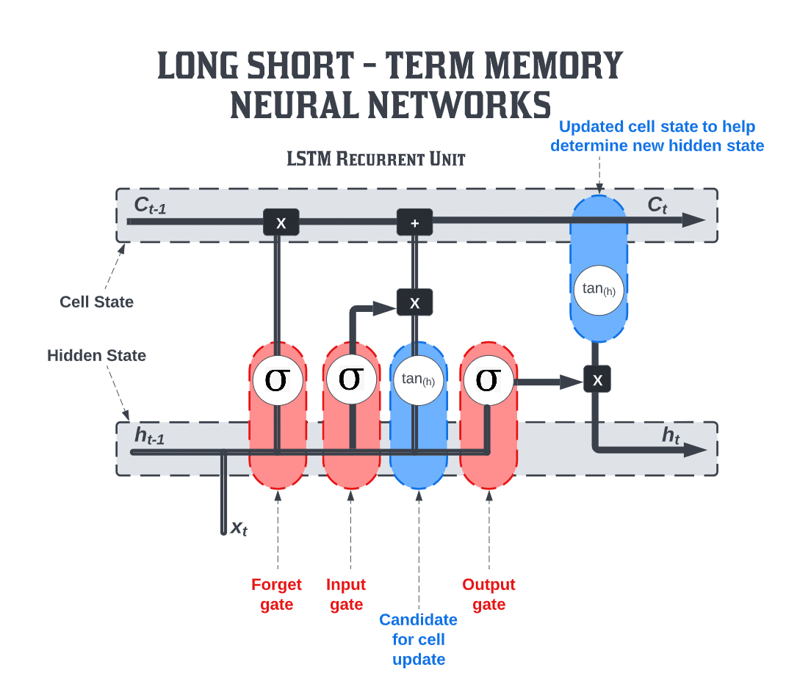
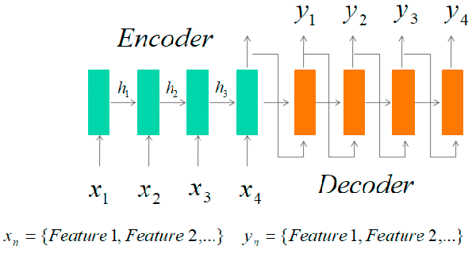
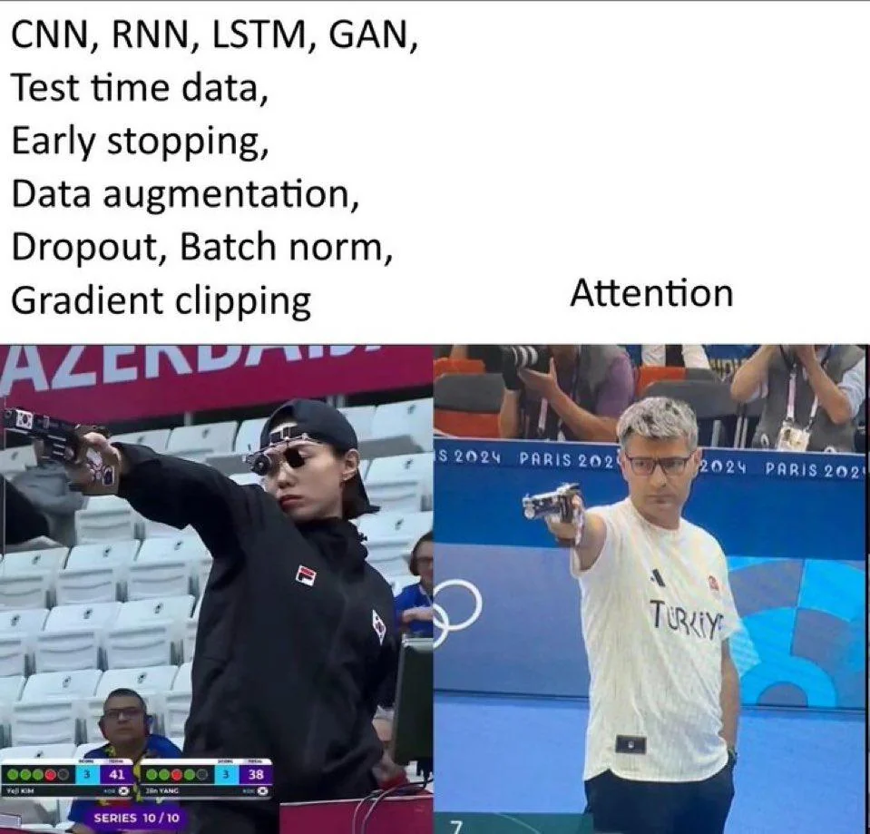
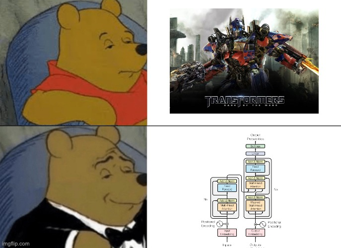

# Natural Language Processing

Natural Language Processing or NLP, is the science of making computers deal with human language.  
It all starts from a simple problem: computers only understand numbers while humans communicate in words.  
This repository is a guided journey through that transformation, from naive word counts to modern Large Language Models.  

---

## What is NLP and why do we even need it?  

NLP is everywhere: in search engines that retrieve documents, in translators like Google Translate, in chatbots like Siri or ChatGPT, and even in spam filters that clean our inbox. The challenge is always the same: take unstructured text and turn it into structured numerical representations that machines can learn from.  

---

## How do we start? Tokenization  

The very first step is **tokenization** — splitting raw text into words or subwords. Without tokenization, the machine cannot even begin to “see” the building blocks of language.  

```python
import nltk
nltk.download("punkt")

text = "I love Natural Language Processing!"
tokens = nltk.word_tokenize(text)
print(tokens)
```

Output:  
```
['I', 'love', 'Natural', 'Language', 'Processing', '!']
```

Tokenization looks trivial, but it hides complexity: how do you handle punctuation, contractions, or rare words? That is why modern systems use subword tokenization.  

---

## From words to numbers: Bag of Words  

Once we tokenize, we need numbers. The **Bag of Words** model was the first attempt. Each document becomes a vector, counting how many times each word occurs.  

```python
from sklearn.feature_extraction.text import CountVectorizer

corpus = ["I love NLP", "NLP loves me"]
vectorizer = CountVectorizer()
X = vectorizer.fit_transform(corpus)

print(vectorizer.get_feature_names_out())
print(X.toarray())
```

Output:  
```
['love' 'loves' 'me' 'nlp']
[[1 0 0 1]
 [0 1 1 1]]
```

It works, but it is blind to order *“dog bites man”* looks the same as *“man bites dog.”*  

---

## Weighing importance: TF-IDF  

Not all words matter equally. Words like *the* or *is* appear everywhere but add little meaning. **TF-IDF (Term Frequency – Inverse Document Frequency)** solves this by down-weighting frequent words and up-weighting rare, informative ones.  

---

## Beyond counting: Word Embeddings  

BoW and TF-IDF represent documents as counts or weighted counts of independent tokens, so they ignore order and context. Neural word embeddings changed this by mapping words to dense vectors where distances and directions capture usage and similarity. That’s why analogies like king − man + woman ≈ queen can emerge in well-trained models. In code, a word2vec model learns these vectors from a corpus; tiny toy data won’t show much.

One limitation of classic embeddings is that each word gets a single vector, so bank in river bank looks like bank in money bank. Contextual models like BERT generate different vectors per sentence, fixing that ambiguity. 

---

## Memory enters the game: RNNs  

Language is sequential. To capture sequences, we built **Recurrent Neural Networks (RNNs)**. They carry a hidden state forward word by word, remembering context. But memory fades with long sentences >>> **vanishing gradient problem**:

<p align="center">
    
</p>

---

## Extending memory: LSTMs

The fix was **LSTMs** and **GRUs**. With gates to decide what to keep or forget, they stretched memory over longer texts. Translation, speech recognition, and text generation became possible. Yet they were still slow, processing one token at a time.  

<p align="center">
    
</p>

---

## Translating sequences: Seq2Seq  

Seq2Seq paired an **encoder** with a **decoder**. The encoder compressed a sentence into a vector, the decoder unfolded it. Elegant, but bottlenecked: long sentences collapsed under the weight of one vector.  

<p align="center">
    
</p>
---

## Attention is all you need!!

The breakthrough was **attention**. Instead of relying on one compressed vector, the decoder could “attend” to different words in the input with different weights. The model could focus on exactly what mattered.  

<p align="center">
    
</p>

---

## Transformers  

Transformers removed recurrence entirely. With **self-attention**, every token looks at every other token, all at once. **Multi-head attention** adds multiple perspectives, while **positional encodings** bring back order.  

<p align="center">
    
</p>

This architecture was faster, parallelizable, and far more accurate. It became the foundation of modern NLP.  

---

## The giants: Large Language Models  

**BERT** was trained to understand by masking words and predicting them, excelling at comprehension.  
**GPT** was trained to generate by predicting the next word, excelling at creation.  

Scaling laws showed that simply making models bigger and training them on more data made them dramatically better. This gave rise to the modern Large Language Models we know today.  

---

## Steering the giants: Prompting and RAG  

With power came problems: hallucinations, biases, and enormous costs. The answer was **prompting** — the art of steering models with clever instructions like zero-shot, few-shot, and chain-of-thought reasoning.  

To reduce hallucination, **RAG (Retrieval-Augmented Generation)** ties a language model to an external knowledge base, forcing it to retrieve facts before generating answers.  

---

## Closing thoughts  

The story of NLP is a ladder:  
- from counting words (Bag of Words, TF-IDF),  
- to meaning (embeddings),  
- to memory (RNNs, LSTMs),  
- to focus (attention),  
- to revolution (transformers),  
- and finally to today’s massive models (LLMs, prompting, RAG).  

Every step solved one problem and created another, driving the field forward. This repo is both a history lesson and a hands-on guide — a place to explore the code that shaped the language technology we use today.  
