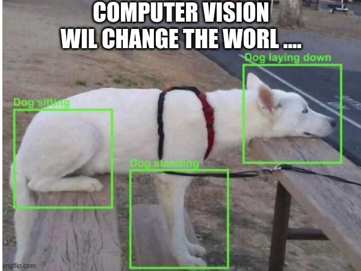

# From Pixels to Perception — Understanding CNNs from Scratch

If you’ve ever wondered how a machine “sees,” this repo takes you on that trip.  
We’ll start from raw pixels — just numbers — and walk step by step into how a Convolutional Neural Network turns them into meaning, from edges to eyes to entire objects.  

    

---

## How Computers See Images

Computers don’t see cats, cars, or people — they see matrices.  
Every image is a collection of pixel values between 0 and 255.  
In grayscale, each pixel is one number.  
In color, each pixel has three values (R, G, B).  
That’s the raw visual world for a machine.

When you feed this matrix into a network, each pixel becomes part of a pattern.  
CNNs learn those patterns automatically — without us having to tell them what a “curve” or “eye” looks like.  

---

## Image Processing Basics — Convolution, Kernel, Padding, and Stride

    

### Convolution
The **convolution** layer is the first thing every CNN learns from.  
You take a small filter (called a **kernel**, e.g. 3×3 or 5×5), slide it over the image, multiply the overlapping values, sum them up, and get one number.  
That new number becomes part of a new image called a **feature map**.

Each kernel learns to detect something: horizontal edges, vertical lines, textures, or patterns.  
Multiple filters create multiple feature maps, each focusing on different visual cues.

### Padding

    

Sometimes when the kernel slides, it doesn’t fit perfectly — the edges of the image get smaller after every convolution.  
**Padding** fixes that by adding zeros around the image borders so the output keeps the same size.  
Without padding, your image would keep shrinking layer after layer.

### Stride
**Stride** is how far the filter moves each step.  
Stride = 1 means it moves pixel by pixel; stride = 2 skips one.  
Higher stride → smaller output → faster but less detail.

So padding and stride are just two dials controlling how much detail you keep versus how fast you compute.

---

## Activation Functions — Giving the Network Life

Convolution alone is linear — like drawing straight lines through data.  
To make the network *learn complex shapes*, we use activation functions to introduce non-linearity.

    

- **ReLU (Rectified Linear Unit)** → `max(0, x)`   
  Kills negatives, keeps positives. Fast and widely used.
- **Leaky ReLU** → lets a tiny negative leak through so neurons don’t die.  
- **Sigmoid** → compresses everything between 0 and 1 — useful for probabilities, but can saturate.  
- **tanh** → like sigmoid but centered at 0 (-1 to 1).  
- **Softmax** → used at the very end to turn outputs into probabilities that sum to 1.

Without activations, CNNs would just be stacks of linear equations.  
With them, they become capable of learning curves, textures, and boundaries.

---

## Pooling Layers — Shrinking but Keeping Meaning

Once we’ve extracted features, we don’t need every single pixel anymore.  
**Pooling** reduces the spatial size but keeps essential information.

    

- **Max Pooling:** takes the maximum value from each 2×2 window.  
- **Average Pooling:** takes the mean instead.

Pooling gives **translation invariance** — the model still recognizes a cat even if it moves slightly in the frame.  

---

## Flattening and Fully Connected Layers

<table>
<tr>
<td style="width:60%; vertical-align:top; text-align:left;">
  
After several convolution + pooling stages, the image is now represented by a stack of feature maps.  
To make a final decision, we **flatten** them into a single long vector and feed it into **Fully Connected (FC)** layers.  
Every neuron in an FC layer connects to every neuron in the next layer.  
That’s where all the extracted features combine to predict the final class.

</td>
<td style="width:40%; text-align:right;">

</td>
</tr>
</table>

---

## The Complete CNN Pipeline

    

1. **Input Layer:** raw pixels.  
2. **Convolution:** extract local patterns.  
3. **ReLU Activation:** keep useful signals.  
4. **Pooling:** compress without losing meaning.  
5. **Flatten:** reshape into one long vector.  
6. **Fully Connected Layer:** combine features into decisions.  
7. **Softmax Output:** convert to probabilities.

Each layer learns something new. Early layers learn edges, middle layers learn shapes, final layers learn semantics.

---

## Training CNNs — The Learning Loop

### Forward Pass
The image moves layer by layer.  
Each layer transforms it and sends results forward until the final prediction pops out.

### Loss Function
We compare the prediction ŷ to the real label y using a **loss function**.  
For classification, it’s usually **Cross-Entropy Loss**.  
Loss = how wrong the network is.

### Backpropagation
Errors flow backward, computing partial derivatives for each weight.  
The model then adjusts every parameter slightly in the opposite direction of the gradient.

### Optimizers
The math of adjustment is handled by optimizers such as:
- **SGD** (Stochastic Gradient Descent)  
- **Adam** (faster, adaptive learning rate)  
- **RMSprop** (smooths oscillations)

### Epochs
One full pass over the dataset = 1 epoch.  
Dozens or hundreds of epochs later, the model starts to “see.”

---

## Overfitting, Underfitting, and Regularization

When the network memorizes training data, it **overfits**.  
When it’s too simple to capture patterns, it **underfits**.  

We fight overfitting with:
- **Dropout:** randomly turning off neurons.  
- **Data Augmentation:** rotate, flip, zoom, shift images.  
- **Batch Normalization:** stabilize activations and gradients.  
- **Early Stopping:** stop training when validation accuracy stops improving.

Good CNNs generalize — they recognize *new* images, not just the old ones.

---

## CNN Tasks — What They Can Actually Do

    

### Image Classification  
Predict what’s in the image.  
Input: an image.  
Output: one label.  
Used in everything from photo tagging to medical scans.

### Object Detection  
Predict both *what* and *where*.  
Outputs bounding boxes + labels.  
Models: **YOLO**, **SSD**, **Faster R-CNN**.  

### Image Segmentation  
Predict class for *every pixel*.  
Used for medical imaging, autonomous driving, satellite maps.  
Models: **U-Net**, **Mask R-CNN**.

### Feature Extraction  
Turn an image into a vector representation (embedding) for search or recommendation systems.

### Image Generation & Style Transfer  
CNNs inside GANs create new images or merge artistic styles.

### Video Analysis  
Combine CNNs + temporal models (RNN/Transformer) to recognize actions over time.

---

## CNN in Practice — Why It Works

The power of CNNs lies in **hierarchical feature learning**.  
They build from small patterns to large ones automatically.  
Each layer reuses knowledge from the one before it.

**Weight sharing** keeps them efficient — one small kernel slides everywhere instead of assigning a new weight per pixel.  
That’s why CNNs scale to millions of images without exploding in size.

---

## Putting It All Together — Training Flow Recap

1. Load and normalize images.  
2. Build the CNN architecture.  
3. Forward pass → predict.  
4. Compute loss.  
5. Backpropagate gradients.  
6. Update weights via optimizer.  
7. Validate on unseen data.  
8. Repeat for many epochs until convergence.

Training is iterative curiosity — try, fail, adjust, repeat — until the network stops guessing and starts seeing.

---

## Beyond CNNs — When Vision Meets Language

Modern systems combine CNNs with other architectures:
- **RNNs / LSTMs** to analyze sequences (like video frames).  
- **Transformers** for vision-language models (like CLIP or ViT).  
CNNs still handle the raw pixels, but the higher reasoning happens through attention.

---

<strong>Congrats, you just survived the deep end of CNNs — now you don’t just use them, you understand how they think.</strong>

